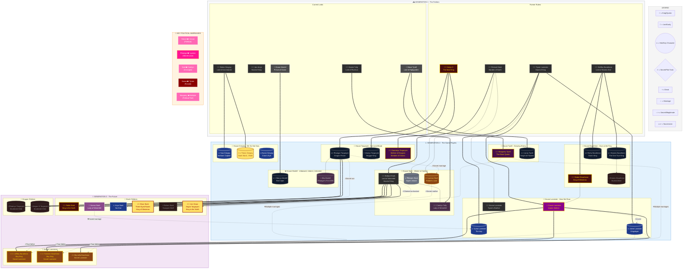

# Houses in Game Of Thrones

```mermaid
---
config:
  layout: fixed
---
flowchart TB
 subgraph LEGEND["LEGEND"]
    direction LR
        legend1["👑 = King/Queen"]
        legend2("🏰 = Lord/Lady")
        legend3(("⚔️ = Heir/Key Character"))
        legend4{"🔥 = Secret/Plot-Twist"}
        legend5["💀 = Dead"]
        legend6["--- = Marriage"]
        legend7["-.-> = Secret/Illegitimate"]
        legend8["==> = Succession"]
  end
 subgraph OLDRULERS["Former Rulers"]
        AerysT["👑💀 Aerys II<br>The Mad King"]
        RickardS["🏰💀 Rickard Stark<br>Warden of North"]
        TywinL["🏰💀 Tywin Lannister<br>Hand of King"]
        SteffoneB["🏰💀 Steffon Baratheon<br>Lord of Storms End"]
  end
 subgraph LIVINGLORDS["Current Lords"]
        HosterT["🏰💀 Hoster Tully<br>Lord of Riverrun"]
        JonA["🏰💀 Jon Arryn<br>Hand of King"]
        MaceT["🏰 Mace Tyrell<br>Lord of Highgarden"]
        DoranM["🏰 Doran Martell<br>Prince of Dorne"]
        BalonG["🏰💀 Balon Greyjoy<br>Lord of Iron Islands"]
  end
 subgraph GEN1["🕰️ GENERATION 1 - The Fathers"]
    direction LR
        OLDRULERS
        LIVINGLORDS
  end
 subgraph STARK["🐺 House Stark - Winter is Coming"]
    direction TB
        NedS["🏰💀 Eddard Stark<br>Lord of Winterfell<br>Hand of King"]
        CatS["🏰💀 Catelyn Tully<br>Lady of Winterfell"]
        BenjenS@{ label: "⚔️❓ Benjen Stark<br>Night's Watch" }
        LyannaS@{ label: "🔥💀 Lyanna Stark<br>Robert's Love" }
  end
 subgraph LANNISTER["🦁 House Lannister - Hear Me Roar"]
    direction TB
        CerseiL["👑 Cersei Lannister<br>Queen Mother"]
        JaimeL[("⚔️ Jaime Lannister<br>Kingslayer")]
        TyrionL[("⚔️ Tyrion Lannister<br>The Imp")]
        KevanL@{ label: "🏰💀 Kevan Lannister<br>Tywin's Brother" }
  end
 subgraph BARATHEON["🦌 House Baratheon - Ours is the Fury"]
    direction TB
        RobertB["👑💀 Robert Baratheon<br>King of Westeros"]
        StannisB[("⚔️💀 Stannis Baratheon<br>The One True King")]
        RenlyB[("⚔️💀 Renly Baratheon<br>Storm King")]
        ShireenB[("💀 Shireen Baratheon<br>Burned Alive")]
  end
 subgraph TARGARYEN["🐉 House Targaryen - Fire and Blood"]
    direction TB
        RhaegarT[("⚔️💀 Rhaegar Targaryen<br>Dragon Prince")]
        ViserysT[("💀 Viserys Targaryen<br>Beggar King")]
        DaenerysT["👑💀 Daenerys Targaryen<br>Mother of Dragons<br>Breaker of Chains"]
  end
 subgraph TYRELL["🌹 House Tyrell - Growing Strong"]
    direction TB
        MargaeryT["👑💀 Margaery Tyrell<br>The Rose Queen"]
        LorasT[("⚔️💀 Loras Tyrell<br>Knight of Flowers")]
  end
 subgraph MARTELL["☀️ House Martell - Unbowed, Unbent, Unbroken"]
    direction TB
        OberynM[("⚔️💀 Oberyn Martell<br>Red Viper")]
        EliaM@{ label: "💀 Elia Martell<br>Rhaegar's First Wife" }
  end
 subgraph GREYJOY["🐙 House Greyjoy - We Do Not Sow"]
    direction TB
        YaraG[("⚔️ Yara Greyjoy<br>Ironborn Captain")]
        TheonG[("🔥⚔️ Theon Greyjoy<br>Stark Ward→Reek")]
        EuronG@{ label: "⚔️ Euron Greyjoy<br>Crow's Eye" }
  end
 subgraph GEN2["⚔️ GENERATION 2 - The Game Players"]
        STARK
        LANNISTER
        BARATHEON
        TARGARYEN
        TYRELL
        MARTELL
        GREYJOY
  end
 subgraph STARKHEIRS["🐺 Stark Children"]
    direction TB
        RobbS["👑💀 Robb Stark<br>King in the North"]
        SansaS["🏰 Sansa Stark<br>Lady of Winterfell"]
        AryaS["⚔️ Arya Stark<br>No One"]
        BranS["🔥👑 Bran Stark<br>Three-Eyed Raven<br>King of Westeros"]
        RickonS["💀 Rickon Stark<br>Youngest Wolf"]
        JonS["🔥👑 Jon Snow<br>Aegon Targaryen<br>King in the North"]
  end
 subgraph SECRETLANNISTERS["🦁 Secret Lannisters"]
    direction TB
        JoffreyL["🔥👑💀 Joffrey Baratheon<br>Boy King<br>Secret Lannister"]
        TommenL["🔥👑💀 Tommen Baratheon<br>Boy King<br>Secret Lannister"]
        MyrcellaL["🔥💀 Myrcella Baratheon<br>Secret Lannister"]
  end
 subgraph TARGARYENHEIRS["🐉 Dragon Children"]
    direction TB
        RhaenysT[("💀 Rhaenys Targaryen<br>Murdered Child")]
        AegonT[("💀 Aegon VI Targaryen<br>Murdered Child")]
  end
 subgraph GEN3["👶 GENERATION 3 - The Future"]
        STARKHEIRS
        SECRETLANNISTERS
        TARGARYENHEIRS
  end
 subgraph MARRIAGES["💒 KEY POLITICAL MARRIAGES"]
    direction LR
        M1["Robert ❤️ Cersei<br>(Political)"]
        M2["Rhaegar ❤️ Lyanna<br>(Secret Love)"]
        M3["Ned ❤️ Catelyn<br>(Arranged)"]
        M4["Sansa ❤️ Tyrion<br>(Forced)"]
        M5["Margaery ❤️ Multiple<br>(Political Tool)"]
  end
    RickardS ==> NedS
    RickardS --> BenjenS & LyannaS
    NedS --- CatS
    HosterT ==> CatS
    TywinL ==> JaimeL & CerseiL & TyrionL
    TywinL --> KevanL
    CerseiL -. 🔥Incest .-> JaimeL
    SteffoneB ==> RobertB & StannisB & RenlyB
    StannisB --> ShireenB
    AerysT ==> RhaegarT & ViserysT & DaenerysT
    MaceT ==> MargaeryT & LorasT
    DoranM ==> OberynM
    BalonG ==> YaraG & TheonG
    NedS ==> RobbS & SansaS & AryaS & BranS & RickonS
    NedS -. 🔥Claimed as bastard .-> JonS
    CerseiL ==> JoffreyL & TommenL & MyrcellaL
    JaimeL -. 🔥True father .-> JoffreyL & TommenL & MyrcellaL
    RhaegarT ==> RhaenysT & AegonT
    RhaegarT -. 🔥Secret son .-> JonS
    RobertB --- CerseiL
    RhaegarT -. 🔥Secret marriage .-> LyannaS
    RhaegarT --- EliaM
    LyannaS -. 🔥Secret mother .-> JonS
    SansaS -. 💔Forced marriage .-> TyrionL
    MargaeryT -. 💔Multiple marriages .-> JoffreyL & TommenL
    BenjenS@{ shape: cylinder}
    LyannaS@{ shape: cylinder}
    KevanL@{ shape: rect}
    EliaM@{ shape: cylinder}
    EuronG@{ shape: cylinder}
     AerysT:::deadKing
     RickardS:::deadLord
     TywinL:::deadLord
     SteffoneB:::deadLord
     HosterT:::deadLord
     JonA:::deadLord
     MaceT:::lord
     DoranM:::lord
     BalonG:::deadLord
     NedS:::deadLord
     CatS:::deadLady
     BenjenS:::missing
     LyannaS:::deadReveal
     CerseiL:::queen
     JaimeL:::heir
     TyrionL:::heir
     KevanL:::deadLord
     RobertB:::deadKing
     StannisB:::deadHeir
     RenlyB:::deadHeir
     ShireenB:::deadChild
     RhaegarT:::deadHeir
     ViserysT:::deadHeir
     DaenerysT:::deadQueen
     MargaeryT:::deadQueen
     LorasT:::deadHeir
     OberynM:::deadHeir
     EliaM:::deadLady
     YaraG:::heir
     TheonG:::reveal
     EuronG:::heir
     RobbS:::deadKing
     SansaS:::lady
     AryaS:::heir
     BranS:::revealKing
     RickonS:::deadChild
     JonS:::revealKing
     JoffreyL:::deadRevealKing
     TommenL:::deadRevealKing
     MyrcellaL:::deadReveal
     RhaenysT:::deadChild
     AegonT:::deadChild
     M1:::marriage
     M2:::secretMarriage
     M3:::marriage
     M4:::forcedMarriage
     M5:::marriage
    classDef deadKing fill:#4a0e0e,stroke:#ffd700,stroke-width:3px,color:#ffd700
    classDef king fill:#8b0000,stroke:#ffd700,stroke-width:3px,color:#ffd700
    classDef revealKing fill:#ffe066,stroke:#8b0000,stroke-width:3px,color:#8b0000
    classDef deadQueen fill:#4a0e4a,stroke:#ffd700,stroke-width:3px,color:#ffd700
    classDef queen fill:#8b008b,stroke:#ffd700,stroke-width:3px,color:#ffd700
    classDef deadLord fill:#2d2d2d,stroke:#888,stroke-width:2px,color:#ccc
    classDef lord fill:#4a4a4a,stroke:#fff,stroke-width:2px,color:#fff
    classDef deadLady fill:#4a2d4a,stroke:#888,stroke-width:2px,color:#ccc
    classDef lady fill:#8b4a8b,stroke:#fff,stroke-width:2px,color:#fff
    classDef heir fill:#1e3a8a,stroke:#fff,stroke-width:2px,color:#fff
    classDef deadHeir fill:#0f1a2d,stroke:#888,stroke-width:2px,color:#ccc
    classDef deadChild fill:#2d1a1a,stroke:#666,stroke-width:1px,color:#999
    classDef deadReveal fill:#8b4513,stroke:#ffe066,stroke-width:2px,color:#ffe066
    classDef reveal fill:#ffe066,stroke:#8b4513,stroke-width:2px,color:#8b4513
    classDef deadRevealKing fill:#8b4513,stroke:#ffd700,stroke-width:3px,color:#ffd700
    classDef missing fill:#6b7280,stroke:#374151,stroke-width:2px,color:#fff
    classDef marriage fill:#ff69b4,stroke:#fff,stroke-width:2px,color:#fff
    classDef secretMarriage fill:#ff1493,stroke:#ffe066,stroke-width:2px,color:#fff
    classDef forcedMarriage fill:#8b0000,stroke:#fff,stroke-width:2px,color:#fff
    style GEN1 fill:#f8f9fa,stroke:#6c757d
    style GEN2 fill:#e3f2fd,stroke:#1976d2
    style GEN3 fill:#f3e5f5,stroke:#7b1fa2
    style MARRIAGES fill:#fff3e0,stroke:#f57c00
    style LEGEND fill:#f5f5f5,stroke:#aaa
```